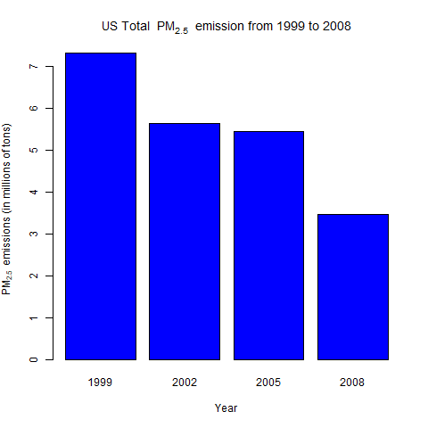

# Coursera - Johns-Hopkins
## Data Science track - #04 Exploratory Data Analysis

web site : [Johns Hopkins University - Coursera](https://www.coursera.org/jhu)

## Course Project

This folder contains the **Course Project 2** of the 4th course of the serie.
 

### Description

The overall goal of this assignment is to explore the National Emissions Inventory database and see what it say about fine particulate matter pollution in the United states over the 10-year period 1999–2008. You may use any R package you want to support your analysis.

### Project files

This folder contains the following files:
- README.md (this file) : simple introduction
- plot**X**.R : the code of each plot
- plot**X**.png : the generated plots (png format)

### Results

1) Have total emissions from PM2.5 decreased in the United States from 1999 to 2008? 

Using the base plotting system, make a plot showing the total PM2.5 emission from all sources for each of the years 1999, 2002, 2005, and 2008.

