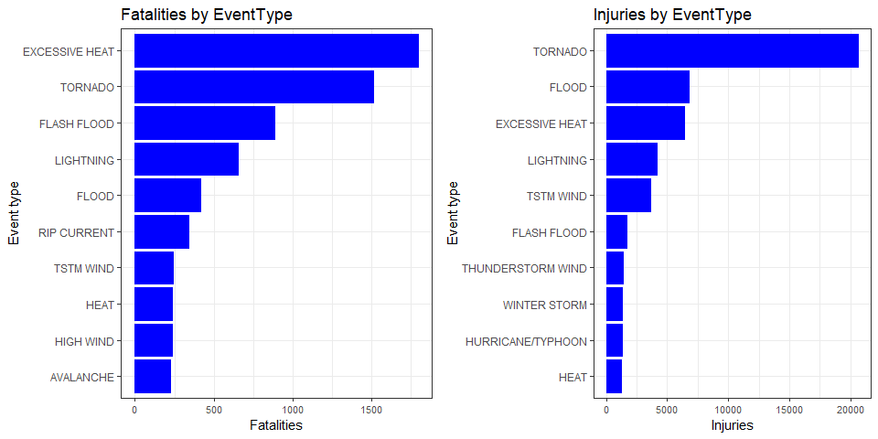
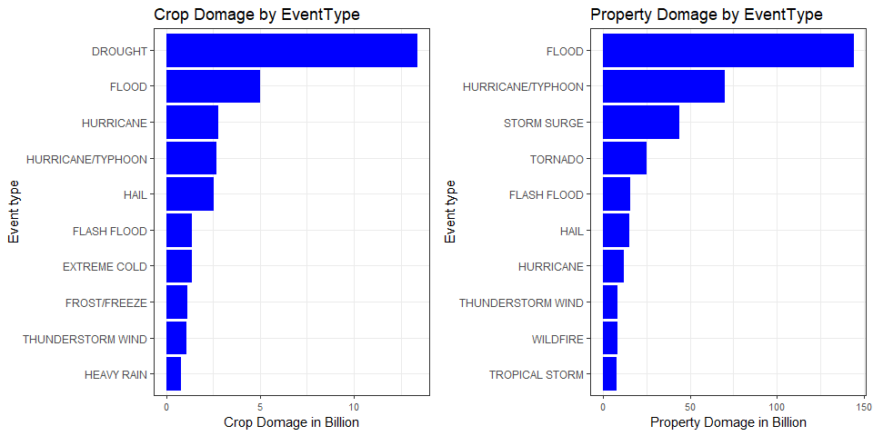

---
output:
  html_document:
    keep_md: yes
  pdf_document: default
---

#Which severe weather events have the most impact population health and economic across the United States
**Course:** Reproducible Research: Peer Assessment 2  
**Author:** chris-FR-GitHub  
**date:** 29th, october 2018  

##Synopsis

Storms and other severe weather events can cause both public health and economic problems for communities and municipalities. Many severe events can result in fatalities, injuries, and property damage, and preventing such outcomes to the extent possible is a key concern.  
  
This project involves exploring the U.S. National Oceanic and Atmospheric Administration's (NOAA) storm database. This database tracks characteristics of major storms and weather events in the United States, including when and where they occur, as well as estimates of any fatalities, injuries, and property damage. 

Since **1996**, EXCESSIVE HEAT (1797) and TORNADO (1511) cause the most fatalities and TORNADO (20667) the most injuries.  
From an economic point of view, FLOOD (144 billions), HURRICANE/TYPHOON (69.3 billions) and STORM SURGE (43.2 billions) cause the most property domages and DROUGHT (13.4 billions) the most crop domages
</br>
</br>
*This is the Peer Assignment **#2** of the `Reproducible Research` course.*

##Loading and Processing the Raw Data

###Environment

We will use the `dplyr`, `ggplot2`, `readr` libraries for this assignment.


```r
library(dplyr, warn.conflicts = FALSE)
library(ggplot2)
library(readr)  # read_csv : returns a tibble
library(lubridate, warn.conflicts = FALSE)
library(gridExtra, warn.conflicts = FALSE)
```

The configuration is:

| Name | Type |  Version |
| :--- | :---: | :---: |
| R |   | 3.4.4 |
| dplyr | package | 0.7.6 |
| ggplot2 | package | 3.0.0 |
| readr | package | 1.1.1 |
| lubridate | package | 1.7.4 |
| gridExtra | package | 2.3 |

To use the same locale as the file one, change the locale to EN.


```r
# we set the current locale to English
oldlocale <- Sys.getlocale("LC_TIME")
Sys.setlocale("LC_TIME", "English")
```

```
## [1] "English_United States.1252"
```

```r
Sys.getlocale("LC_TIME")
```

```
## [1] "English_United States.1252"
```

```r
# Sys.setlocale("LC_TIME", oldlocale)
```
  
###Loading the dataset

> Load the data

We load the data using `readr` package.  


```r
# Download the file
folderdata <- 'data'
if(!dir.exists(folderdata)) dir.create(folderdata)

urlzip <- 'https://d396qusza40orc.cloudfront.net/repdata%2Fdata%2FStormData.csv.bz2'
filedata <- file.path(folderdata, 'repdata_data_StormData.csv.bz2')


if(!file.exists(filedata)){
    download.file(url=urlzip, 
                  destfile = filedata, 
                  mode="wb", quiet = T)
}

# read the file
weather <- read_csv(filedata,
                    col_names = TRUE,
                    col_types = cols(),
                    progress=FALSE)

# keep only the date, and the counters
weather <- weather %>%
    select('BGN_DATE', 'EVTYPE','FATALITIES','INJURIES', 
           'PROPDMG', 'PROPDMGEXP', 'CROPDMG', 'CROPDMGEXP')
```

The dataset has **902297** observations of **8** variables.  
</br>

###Only keeping data collected after 1996

According to NOAA the data recording start from Jan. 1950. At that time they recorded one event type, tornado. They add more events gradually and only from Jan. 1996 they started recording all events type.  
  
To compare all events and not introducing a data bias, we will keep the data after **1996**.


```r
weather$BGN_DATE <- mdy_hms(weather$BGN_DATE)
weather$year <- year(weather$BGN_DATE)

weather <- weather %>%
    filter(year >= 1996)
```

The dataset has now **653530** observations of **38** variables.  
</br>

###Apply PROPDMGEXP and PROPDMGEXP to the values

The **xxxEXP** are exponential values for the Crop and Property domages (Hundred (H), Thousand (K), Million (M) and Billion (B)).


```r
table(weather$PROPDMGEXP)
```

```
## 
##      0      B      K      M 
##      1     32 369938   7374
```

```r
table(weather$CROPDMGEXP)
```

```
## 
##      B      K      M 
##      4 278686   1771
```

We apply these units.


```r
weather <- weather %>% 
    mutate(PROPDMG = PROPDMG * ifelse(PROPDMGEXP == "B", 
                                10^9, 
                                ifelse(PROPDMGEXP == "M", 
                                       10^6, 
                                       ifelse(PROPDMGEXP == "K", 
                                              10^3, 
                                              1
                                       ))),
           CROPDMG = CROPDMG * ifelse(CROPDMGEXP == "B", 
                                      10^9, 
                                      ifelse(CROPDMGEXP == "M", 
                                             10^6, 
                                             ifelse(CROPDMGEXP == "K", 
                                                    10^3, 
                                                    1
                                             )))
    )
```

###EVTYPE cleanup

Some EVTYPE are in diferent upper / lower cases.


```r
paste('unique EVTYPE : ', length(unique(weather$EVTYPE)))
```

```
## [1] "unique EVTYPE :  508"
```

```r
weather$EVTYPE <- toupper(weather$EVTYPE)

paste('unique EVTYPE : ', length(unique(weather$EVTYPE)))
```

```
## [1] "unique EVTYPE :  430"
```

The file [spec](https://d396qusza40orc.cloudfront.net/repdata%2Fpeer2_doc%2Fpd01016005curr.pdf) linked to the project contains the 48 official EVENT TYPE values.  
These values are defined in the **Storm Data Event Table**.  

We stored these values in the `storm_event.csv` file to facilitate the comparison with the actual values.


```r
# read the file storm_event.csv files
eventtype <- read_csv('storm_event.csv',
                    col_names = TRUE,
                    col_types = cols(),
                    progress=FALSE)
eventtype$EVTYPE <- toupper(eventtype$EVTYPE)
head(eventtype)
```

```
## # A tibble: 6 x 1
##   EVTYPE               
##   <chr>                
## 1 ASTRONOMICAL LOW TIDE
## 2 AVALANCHE            
## 3 BLIZZARD             
## 4 COASTAL FLOOD        
## 5 COLD/WIND CHILL      
## 6 DEBRIS FLOW
```

We can now check the valid / invalid EVENT TYPE and the number of associated records:


```r
table(weather$EVTYPE %in% eventtype$EVTYPE)
```

```
## 
##  FALSE   TRUE 
## 148899 504631
```

We will focus on the invalid values top 10 :


```r
weather %>% 
    filter( !(EVTYPE %in% eventtype$EVTYPE) )  %>% 
    group_by(EVTYPE) %>%
    tally() %>%
    arrange(desc(n)) %>%
    top_n(10, n)
```

```
## # A tibble: 10 x 2
##    EVTYPE                    n
##    <chr>                 <int>
##  1 TSTM WIND            128668
##  2 MARINE TSTM WIND       6175
##  3 URBAN/SML STREAM FLD   3392
##  4 WILD/FOREST FIRE       1443
##  5 WINTER WEATHER/MIX     1104
##  6 TSTM WIND/HAIL         1028
##  7 EXTREME COLD            617
##  8 LANDSLIDE               588
##  9 FOG                     532
## 10 SNOW                    425
```

We correct these first values (the first one has the greatest impact) :


```r
weather$EVTYPE <- gsub('TSTM', 'THUNDERSTORM', weather$EVTYPE)
weather$EVTYPE <- gsub('WEATHER/MIX', 'WEATHER', weather$EVTYPE, fixed=TRUE)
weather$EVTYPE <- gsub('WIND/HAIL', 'WIND', weather$EVTYPE, fixed=TRUE)
weather$EVTYPE <- gsub('WILD/FOREST FIRE', 'WILDFIRE', weather$EVTYPE, fixed=TRUE)
table(weather$EVTYPE %in% eventtype$EVTYPE)
```

```
## 
##  FALSE   TRUE 
##  10481 643049
```

We should have continue to check the other values...


#Results

##Impact on population health

We will pick the top 10 events for fatalities and Injuries.


```r
top10fatalities <- weather %>% 
    group_by(EVTYPE) %>%
    summarize(FATALITIES = sum(FATALITIES, na.rm=T)) %>%
    arrange(desc(FATALITIES)) %>%
    top_n(10, FATALITIES)

top10fatalities
```

```
## # A tibble: 10 x 2
##    EVTYPE            FATALITIES
##    <chr>                  <dbl>
##  1 EXCESSIVE HEAT          1797
##  2 TORNADO                 1511
##  3 FLASH FLOOD              887
##  4 LIGHTNING                651
##  5 FLOOD                    414
##  6 THUNDERSTORM WIND        376
##  7 RIP CURRENT              340
##  8 HEAT                     237
##  9 HIGH WIND                235
## 10 AVALANCHE                223
```

```r
top10injuries <- weather %>% 
    group_by(EVTYPE) %>%
    summarize(INJURIES = sum(INJURIES, na.rm=T)) %>%
    arrange(desc(INJURIES)) %>%
    top_n(10, INJURIES)

top10injuries
```

```
## # A tibble: 10 x 2
##    EVTYPE            INJURIES
##    <chr>                <dbl>
##  1 TORNADO              20667
##  2 FLOOD                 6758
##  3 EXCESSIVE HEAT        6391
##  4 THUNDERSTORM WIND     5124
##  5 LIGHTNING             4141
##  6 FLASH FLOOD           1674
##  7 WILDFIRE              1456
##  8 WINTER STORM          1292
##  9 HURRICANE/TYPHOON     1275
## 10 HEAT                  1222
```

Plot the 2 list in a single graph (2 columns).


```r
# plot 1
plotfatalities <- ggplot(top10fatalities, aes(x=reorder(EVTYPE, FATALITIES), y=FATALITIES)) +
    geom_bar(stat='identity', col="blue", fill='blue') +
    coord_flip() +
    theme_bw() +
    theme(axis.text.x = element_text(size = 8)) +
    labs(
        x = 'Event type',
        y = 'Fatalities',
        title = 'Fatalities by EventType'
    )

# plot 2
plotinjuries <- ggplot(top10injuries, aes(x=reorder(EVTYPE, INJURIES), y=INJURIES)) +
    geom_bar(stat='identity', col="blue", fill='blue') +
    coord_flip() +
    theme_bw() +
    theme(axis.text.x = element_text(size = 8)) +
    labs(
        x = 'Event type',
        y = 'Injuries',
        title = 'Injuries by EventType'
    )

grid.arrange(plotfatalities, plotinjuries, ncol = 2)
```

<!-- -->

Since **1996**, EXCESSIVE HEAT (1797) and TORNADO (1511) cause the most fatalities and TORNADO (20667) the most injuries.  


##Impact on economy

We will pick the top 10 events for crop and property domages ( in **Billions** ).  


```r
top10crop <- weather %>% 
    group_by(EVTYPE) %>%
    summarize(CROPDMG = sum(CROPDMG, na.rm=T) / 10^9) %>%
    arrange(desc(CROPDMG)) %>%
    top_n(10, CROPDMG)

top10crop
```

```
## # A tibble: 10 x 2
##    EVTYPE            CROPDMG
##    <chr>               <dbl>
##  1 DROUGHT            13.4  
##  2 FLOOD               4.97 
##  3 HURRICANE           2.74 
##  4 HURRICANE/TYPHOON   2.61 
##  5 HAIL                2.48 
##  6 FLASH FLOOD         1.33 
##  7 EXTREME COLD        1.31 
##  8 FROST/FREEZE        1.09 
##  9 THUNDERSTORM WIND   1.02 
## 10 HEAVY RAIN          0.728
```

```r
top10prop <- weather %>% 
    group_by(EVTYPE) %>%
    summarize(PROPDMG = sum(PROPDMG, na.rm=T) / 10^9) %>%
    arrange(desc(PROPDMG)) %>%
    top_n(10, PROPDMG)

top10prop
```

```
## # A tibble: 10 x 2
##    EVTYPE            PROPDMG
##    <chr>               <dbl>
##  1 FLOOD              144.  
##  2 HURRICANE/TYPHOON   69.3 
##  3 STORM SURGE         43.2 
##  4 TORNADO             24.6 
##  5 FLASH FLOOD         15.2 
##  6 HAIL                14.6 
##  7 HURRICANE           11.8 
##  8 THUNDERSTORM WIND    7.91
##  9 WILDFIRE             7.76
## 10 TROPICAL STORM       7.64
```

Plot the 2 list in a single graph (2 columns).  


```r
# plot 1
plotcrop <- ggplot(top10crop, aes(x=reorder(EVTYPE, CROPDMG), y=CROPDMG)) +
    geom_bar(stat='identity', col="blue", fill='blue') +
    coord_flip() +
    theme_bw() +
    theme(axis.text.x = element_text(size = 8)) +
    labs(
        x = 'Event type',
        y = 'Crop Domage in Billion',
        title = 'Crop Domage by EventType'
    )

# plot 2
plotprop <- ggplot(top10prop, aes(x=reorder(EVTYPE, PROPDMG), y=PROPDMG)) +
    geom_bar(stat='identity', col="blue", fill='blue') +
    coord_flip() +
    theme_bw() +
    theme(axis.text.x = element_text(size = 8)) +
    labs(
        x = 'Event type',
        y = 'Property Domage in Billion',
        title = 'Property Domage by EventType'
    )

grid.arrange(plotcrop, plotprop, ncol = 2)
```

<!-- -->

From an economic point of view, FLOOD (144 billions), HURRICANE/TYPHOON (69.3 billions) and STORM SURGE (43.2 billions) cause the most property domages and DROUGHT (13.4 billions) the most crop domages
