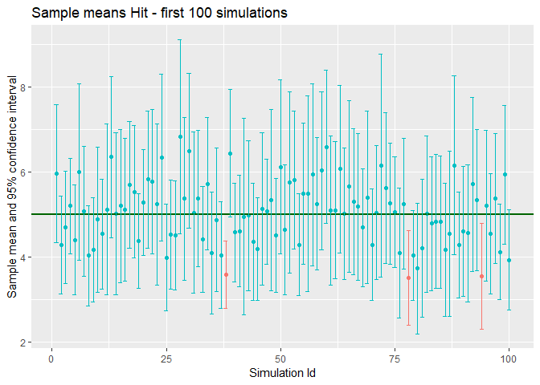
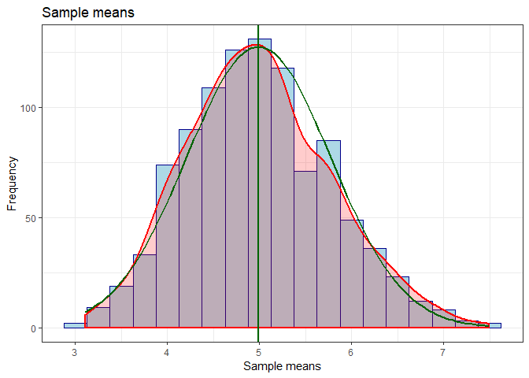

## Synopsis

In this first project, we will investigate the exponential distribution and compare it with the Central Limit Theorem.  
We will do a single sample, a montecarlo simulation and a bootstrap. For each of these section, we will compute the mean and the 95% confidence interval.  
We will use **lambda = 0.2** for all of the simulations.
The mean of exponential distribution is 1/lambda (= 5) and the standard deviation is also 1/lambda (= 5). We will investigate the distribution of averages of 40 exponentials and do a thousand simulations.  


```r
library(tidyverse, warn.conflicts = TRUE)
# constants
lambda <- 0.2     # lambda for rexp
n <- 40           # sample size
nbsim <- 1000     # number of simulations
quantile = 0.975  # 95% with 2.5% on both sides of the range
# Seed
set.seed(1)    # set seed to replicate the results
```

## Single sample

We will pick a single sample, compute its mean and the 95% confidence interval.


```r
# pick single sample
singlesample <- rexp(n , lambda)

# compute the 95% confidence interval
mu <- mean(singlesample)
sigma <- sd(singlesample)
confidenceInterval = round(mu + c(-1, 1) * qt(quantile, df=n-1) * sigma / sqrt(n), 2)

# test : compute the same interval using the t.test function
# t.test(singlesample, conf.level = 0.95)$conf.int

paste('mean : ', round(mu, 2), 
      ' - 95% confidence interval : [', confidenceInterval[1], ' - ', confidenceInterval[2], ']')
```

```
## [1] "mean :  4.86  - 95% confidence interval : [ 3.31  -  6.41 ]"
```


## Montecarlo simulation

We will do 1000 simulations. For each of these simulations, we will store the mean and the 95% confidence interval. 
We add an extra column, indicating if the interval contains the expected mean : 5.


```r
mcs_means <- replicate(nbsim, { 
    dat <- rexp(n , lambda)
    tinterval <- t.test(dat, conf.level = 0.95)$conf.int
    c( mean = mean( dat ), int_inf = tinterval[1], int_max = tinterval[2],
       contains_exp_mean = tinterval[1] <= 5 & 5 <= tinterval[2])
}) 
mcs_means=as.tibble(t(mcs_means))
# add the row number as a column (for the graph)
mcs_means$idsim <- as.numeric(row.names(mcs_means))
head(mcs_means,3)
```

```
## # A tibble: 3 x 5
##    mean int_inf int_max contains_exp_mean idsim
##   <dbl>   <dbl>   <dbl>             <dbl> <dbl>
## 1  5.96    4.34    7.59                 1     1
## 2  4.28    3.13    5.42                 1     2
## 3  4.70    3.38    6.03                 1     3
```

```r
# we can check the number of samples containing the expected mean
table(mcs_means$contains_exp_mean)
```

```
## 
##   0   1 
##  58 942
```
942 sample confidence intervals contained the expected vale (5) => 94%. We can see this better by checking the first 100 simulation mean and confidence interval.

```r
mcs_means %>% filter(idsim <= 100) %>% 
    ggplot(aes(x= idsim,y=mean, color=as.factor(contains_exp_mean))) +
    geom_point() +
    geom_hline(yintercept = 5, color="darkgreen", size=1) +
    geom_errorbar(aes(ymin=int_inf, ymax=int_max)) +
    labs(x = 'Simulation Id', y = 'Sample mean and 95% confidence interval',
        title = 'Sample means Hit - first 100 simulations' ) +
    theme(legend.position="none")
```

<!-- -->


```r
binwidth = 0.25
ndmean <- mean(mcs_means$mean)
ndsd <- sd(mcs_means$mean)
ndvar <- var(mcs_means$mean)

mcs_means %>% ggplot(aes(x= mean)) + 
    geom_histogram(fill='lightblue', color='darkblue', binwidth = binwidth, size = 0.1) +
    geom_density(aes(y=binwidth * ..count..), alpha=.2, fill="red", color="red", size=.75) +
    theme_bw() +
    labs(x = 'Sample means', y = 'Frequency', title = 'Sample means' ) +
    geom_vline(xintercept = ndmean, color='darkgreen', size = 1) +
    stat_function(fun = function(x) dnorm(x, mean = ndmean, sd = ndsd) * nbsim * binwidth,
                  color = "darkgreen", size = 1)
```

<!-- -->

As stated by the CLT, the distribution of the means (in red) is approximatively a standard normal (in green) of mean **4.989** and sd **0.782**.  
The variance **0.612** is approximatively equal to  the variance of the distribution of the means of samples of 40 exponentials : (1/lambda^2/n) = **0.625**.

## Bootstrap (==just to test==)

We will just do a simple test of the bootstrap method. Pick a single sample, then resample it using the **boot** package.  


```r
library(boot)
# pick a single sample
singlesample <- rexp(n , lambda)
# bootstrap
meanBoot <- boot(singlesample,
             function(x,i) mean(x[i]),
             R=1000)

# The mean based on the bootstrap method.
mean(meanBoot$t[,1])
```

```
## [1] 4.983227
```

```r
# The variance based on the bootstrap method.
var(meanBoot$t[,1])
```

```
## [1] 0.8304202
```

```r
# compute the confidence interval with different method provided by the package
boot.ci(meanBoot,
        conf = 0.95,
        type = c("norm", "basic" ,"perc", "bca")
)
```

```
## BOOTSTRAP CONFIDENCE INTERVAL CALCULATIONS
## Based on 1000 bootstrap replicates
## 
## CALL : 
## boot.ci(boot.out = meanBoot, conf = 0.95, type = c("norm", "basic", 
##     "perc", "bca"))
## 
## Intervals : 
## Level      Normal              Basic         
## 95%   ( 3.364,  6.936 )   ( 3.306,  6.911 )  
## 
## Level     Percentile            BCa          
## 95%   ( 3.222,  6.827 )   ( 3.544,  7.197 )  
## Calculations and Intervals on Original Scale
## Some BCa intervals may be unstable
```

