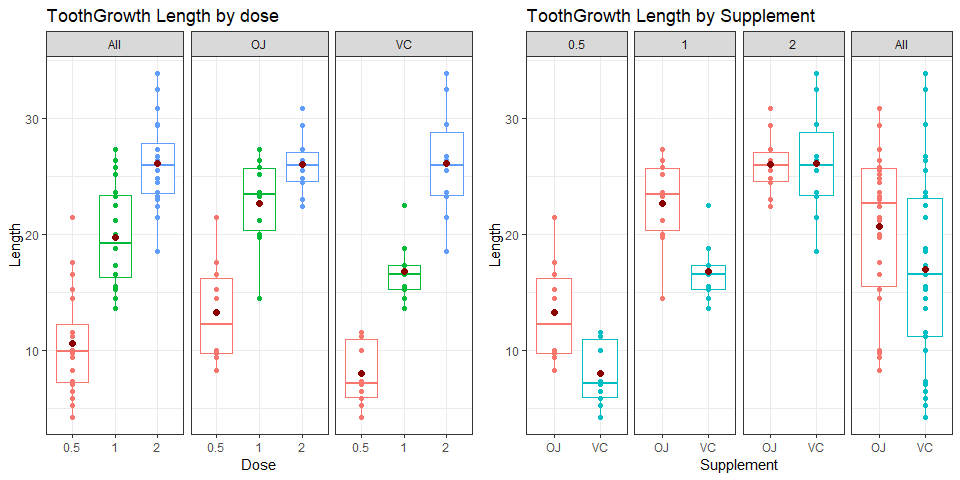

## Synopsis

In this second project, we will investigate the **ToothGrowth** dataset from the basic R datasets package.  
We will try to quicly analyse the data and to test some hypothesis about the dose and supplement impact on the guinea pigs' tooth growth.  

## Load the ToothGrowth data 


```r
library(tidyverse, warn.conflicts = TRUE)
library(gridExtra, warn.conflicts = FALSE)
# Load the dataset
data("ToothGrowth")
# check the data types
str(ToothGrowth)
```

```
## 'data.frame':	60 obs. of  3 variables:
##  $ len : num  4.2 11.5 7.3 5.8 6.4 10 11.2 11.2 5.2 7 ...
##  $ supp: Factor w/ 2 levels "OJ","VC": 2 2 2 2 2 2 2 2 2 2 ...
##  $ dose: num  0.5 0.5 0.5 0.5 0.5 0.5 0.5 0.5 0.5 0.5 ...
```

We have :  
- 3 doses : 0.5, 1, and 2 mg/day  
- 2 delivery methods for the vitamin C : OJ (Orange Juice) and VC (Ascorbic Acid).  
Each combination has 10 rows.  

## Provide a basic summary of the data.

We will run a summary type function but also add all the aggregated records (global data, OJ only, VC only, dose 0.5 only, ...).  


```r
# Helper function (replicate the summary base fucntion)
mysummary <- function(dat){
    data.frame(
        Min = min(dat), Quantile25 = quantile(dat, 0.25),
        Median = median(dat), Mean = mean(dat),
        Quantile75 = quantile(dat, 0.75), Max = max(dat)  )}

# convert the factor / numeric in char to aggreagate the data in a single table.
ToothGrowthTab <- ToothGrowth %>% mutate(dose = as.character(dose),
                                         supp = as.character(supp))
# build the summary dataset
ToothGrowthTab  %>% group_by(supp, dose) %>% do( mysummary(.$len)) %>%
    rbind(. , ToothGrowthTab  %>% mutate(dose='-') %>% group_by(supp, dose) %>%
              do( mysummary(.$len)) ) %>%
    rbind(., ToothGrowthTab  %>% mutate(supp='-') %>% group_by(supp, dose) %>%
              do( mysummary(.$len)) )  %>%
    rbind(., ToothGrowthTab  %>% mutate(supp='-', dose = '-') %>%
              group_by(supp, dose) %>%
              do( mysummary(.$len)) ) %>% arrange(supp, dose)
```

```
## # A tibble: 12 x 8
## # Groups:   supp, dose [12]
##    supp  dose    Min Quantile25 Median  Mean Quantile75   Max
##    <chr> <chr> <dbl>      <dbl>  <dbl> <dbl>      <dbl> <dbl>
##  1 -     -       4.2      13.1   19.2  18.8        25.3  33.9
##  2 -     0.5     4.2       7.22   9.85 10.6        12.2  21.5
##  3 -     1      13.6      16.2   19.2  19.7        23.4  27.3
##  4 -     2      18.5      23.5   26.0  26.1        27.8  33.9
##  5 OJ    -       8.2      15.5   22.7  20.7        25.7  30.9
##  6 OJ    0.5     8.2       9.7   12.2  13.2        16.2  21.5
##  7 OJ    1      14.5      20.3   23.5  22.7        25.6  27.3
##  8 OJ    2      22.4      24.6   26.0  26.1        27.1  30.9
##  9 VC    -       4.2      11.2   16.5  17.0        23.1  33.9
## 10 VC    0.5     4.2       5.95   7.15  7.98       10.9  11.5
## 11 VC    1      13.6      15.3   16.5  16.8        17.3  22.5
## 12 VC    2      18.5      23.4   26.0  26.1        28.8  33.9
```

We will plot these data to have a better view.


```r
addallfacet <- function(dat, col){
    dat$facet <- dat[[col]]
    newdat <- dat
    newdat$facet <- "All"
    return(rbind(newdat, dat))
}

plot1 <- addallfacet(ToothGrowth, 'supp')  %>% mutate(dose = as.factor(dose)) %>%
    ggplot(aes(dose, len, color=dose)) +
    geom_boxplot() + geom_point() + facet_grid(~facet) + theme_bw() +
    theme(legend.position = "none") +
    stat_summary(fun.y = mean, geom="point",colour="darkred", size=2) +
    labs(title="ToothGrowth Length by dose", x="Dose", y="Length")
plot2 <- addallfacet(ToothGrowth, 'dose')  %>%
    ggplot(aes(supp, len, color=supp)) + geom_boxplot() + geom_point() + facet_grid(~facet) +
    theme_bw() + theme(legend.position = "none") +
    stat_summary(fun.y = mean, geom="point",colour="darkred", size=2) +
    labs(title="ToothGrowth Length by Supplement", x="Supplement", y="Length")
grid.arrange(plot1, plot2, ncol = 2)
```

<!-- -->

## Hypothesis tests to compare tooth growth by supp and dose

We will use t-tests to validate / invalidate the 2 following hypothesis :  
- The hiher the dose, the higher the effect,  
- Orange juice seem to have a higher effect than Ascorbic Acid.  


```r
# t-test helmper function
getPValue <- function(pdose1 = 0, pdose2 = 0, psupp1 = 'All', psupp2 = 'All', alt){
    t.test(
    ToothGrowth %>%
        filter(pdose1 == 0 | dose==pdose1, psupp1 == 'All' | supp==psupp1) %>% select(len),
    ToothGrowth %>% 
        filter(pdose2 == 0 |dose==pdose2, psupp2 == 'All' | supp==psupp2) %>% select(len),
    alternative = alt, paired = FALSE, var.equal = FALSE,
    conf.level = 0.95)$p.value
}
```

We assume that  
- the pigs where selected randomly and are **representative of the population**  
- and that the experiment were **independant** (no paired test)  

### Dose impact

| Dose difference |   from 0.5 to 1 mg/day   |   from 1 to 2 mg/day   |   from 0.5 to 2 mg/day   |
| -------------------- | -------------------------- | ---------------------------- | ------------------------------- |
| All | $6.3415036\times 10^{-8}$ | $9.5321476\times 10^{-6}$ | $2.1987625\times 10^{-14}$ |
| OJ | $4.3924595\times 10^{-5}$ | $0.0195976$ | $6.6189194\times 10^{-7}$ |
| VC | $3.4055089\times 10^{-7}$ | $4.5778015\times 10^{-5}$ | $2.3407887\times 10^{-8}$ |


The higher the dose, the higher is the impact for the tooth length. It is true for both supplement.  
Even if there is a difference for Orange Juice between 1 and 2 mg/day, it is a little bit less important tahn between .5 and 1 mg/day.  

### Supplement difference impact

| Supplement |   At 0.5 mg/day   |   At 1 mg/day   |   At 2 mg/day   |   All   |
| :--------- | :-----------: | :-----------: | :-----------: | :------------: |
| OJ vs VC | $0.0031793$ | $5.1918794\times 10^{-4}$| $0.5180742$ | $0.0303173$ |

Orange Juice (OJ) seems to have a better effect than Ascorbic Acid (VC).  
This statement is only false at 2 mg/day - at this dose, the 2 supplements have the same effect (p-value > 0.05)


