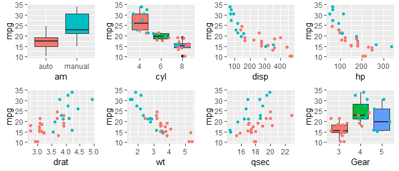
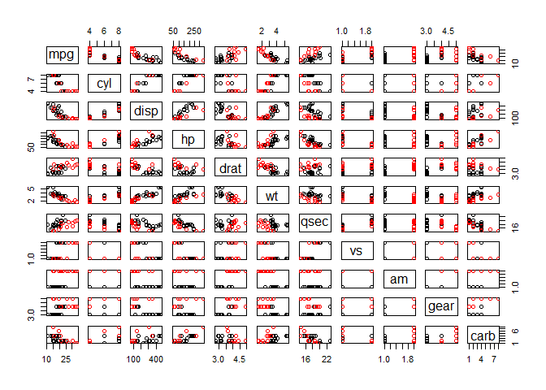
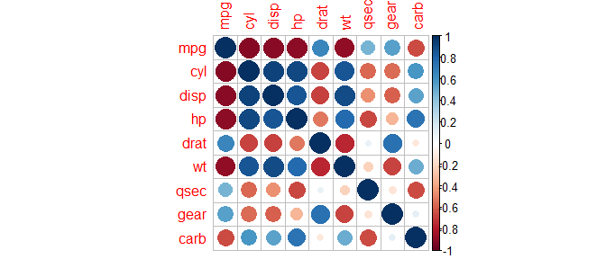

## Synopsis

In this week project, we will explore a data set containing a collection of cars and try to determine if there is a difference between automatic and manual transmissions in term of MPG. (The code of this document is available on Github)

## Data


The data used for this project is the mtcars (Motor Trend Car Road Tests) dataset. It contains **32** cars (rows) and  **11** columns (**mpg, cyl, disp, hp, drat, wt, qsec, vs, am, gear, carb**).  
We will just convert AM and VS to factors.

```r
mtcars$am <- factor(mtcars$am, levels = c(0, 1), labels = c("auto", "manual"))
mtcars$vs <- factor(mtcars$vs)
```

## Exploratory analysis

The **str** and **summary** function results are in the appendix. The repartition automatic and manual is the following:

```
##        count percentage
## auto      19     59.375
## manual    13     40.625
```
If we check the MPG value compared to the other column:  



MPG is highly correlated to some features. The complete correlation plot is on appendix.

```
##   cyl  disp    hp  drat    wt  qsec  gear  carb 
## -0.91 -0.91 -0.89  0.65 -0.89  0.47  0.54 -0.66
```

## MPG vs AM

From the first graph, there seems to have a difference in MPG between the 2 transmissions. 

```r
t<- t.test( mpg~am, data = mtcars, 
            alternative = "two.sided", paired = FALSE, var.equal = FALSE, conf.level = 0.95)
```
The p-value is **0.0014** and the 95% interval does not contains 0, so we can say that there is a difference in MPG between these 2 transmission types. if we create a model from this feature only :

```r
fitam <- lm(mpg~am, mtcars)
summary(fitam)$coefficient
```

```
##              Estimate Std. Error   t value     Pr(>|t|)
## (Intercept) 17.147368   1.124603 15.247492 1.133983e-15
## ammanual     7.244939   1.764422  4.106127 2.850207e-04
```

Even if there is a difference between the 2 transmissions (manual having a **7.24** higher MPG), this feature only is not a very good predictor : the Adjusted R-squared value is **0.338** . Let's check if we can find a better model using the other features.

## Feature selection using step
In the feature selection video, the **step** function was indroduced. We will try to use it to find a better model and see if the transmission is part of it.I used : http://www.stat.columbia.edu/~martin/W2024/R10.pdf as a starter code.


```r
fit.null<-lm(mpg~1, data=mtcars)
fit.full<-lm(mpg~., data=mtcars)
# trying the 3 ways
step_fw <- step(fit.null, scope=list(lower=fit.null, upper=fit.full), direction="forward", trace=0)
step_bc <- step(fit.full, data=mtcars, direction="backward", trace=0)
step_bo <- step(fit.null, scope = list(upper=fit.full), data=mtcars, direction="both", trace=0)
```
| direction | formula | Adjusted R-squared |
| ---- | ---- | ---- |
| forward | mpg ~ wt + cyl + hp | 0.826 |
| backward | mpg ~ wt + qsec + am | 0.834 |
| both | mpg ~ wt + cyl + hp | 0.826 |

## Conclusion
If we pick the backward step result as our final model : **mpg ~ wt + qsec + am**, Manual transmissions have a slightly better MPG (**2.94**) than the automatic ones (in the 1974's).

```r
summary(step_bc)$coefficient
```

```
##              Estimate Std. Error   t value     Pr(>|t|)
## (Intercept)  9.617781  6.9595930  1.381946 1.779152e-01
## wt          -3.916504  0.7112016 -5.506882 6.952711e-06
## qsec         1.225886  0.2886696  4.246676 2.161737e-04
## ammanual     2.935837  1.4109045  2.080819 4.671551e-02
```
## Appendix

### Exploratory analysis


```r
str(mtcars)
```

```
## 'data.frame':	32 obs. of  11 variables:
##  $ mpg : num  21 21 22.8 21.4 18.7 18.1 14.3 24.4 22.8 19.2 ...
##  $ cyl : num  6 6 4 6 8 6 8 4 4 6 ...
##  $ disp: num  160 160 108 258 360 ...
##  $ hp  : num  110 110 93 110 175 105 245 62 95 123 ...
##  $ drat: num  3.9 3.9 3.85 3.08 3.15 2.76 3.21 3.69 3.92 3.92 ...
##  $ wt  : num  2.62 2.88 2.32 3.21 3.44 ...
##  $ qsec: num  16.5 17 18.6 19.4 17 ...
##  $ vs  : Factor w/ 2 levels "0","1": 1 1 2 2 1 2 1 2 2 2 ...
##  $ am  : Factor w/ 2 levels "auto","manual": 2 2 2 1 1 1 1 1 1 1 ...
##  $ gear: num  4 4 4 3 3 3 3 4 4 4 ...
##  $ carb: num  4 4 1 1 2 1 4 2 2 4 ...
```

```r
summary(mtcars[, sapply(mtcars, class) == "numeric"])
```

```
##       mpg             cyl             disp             hp       
##  Min.   :10.40   Min.   :4.000   Min.   : 71.1   Min.   : 52.0  
##  1st Qu.:15.43   1st Qu.:4.000   1st Qu.:120.8   1st Qu.: 96.5  
##  Median :19.20   Median :6.000   Median :196.3   Median :123.0  
##  Mean   :20.09   Mean   :6.188   Mean   :230.7   Mean   :146.7  
##  3rd Qu.:22.80   3rd Qu.:8.000   3rd Qu.:326.0   3rd Qu.:180.0  
##  Max.   :33.90   Max.   :8.000   Max.   :472.0   Max.   :335.0  
##       drat             wt             qsec            gear      
##  Min.   :2.760   Min.   :1.513   Min.   :14.50   Min.   :3.000  
##  1st Qu.:3.080   1st Qu.:2.581   1st Qu.:16.89   1st Qu.:3.000  
##  Median :3.695   Median :3.325   Median :17.71   Median :4.000  
##  Mean   :3.597   Mean   :3.217   Mean   :17.85   Mean   :3.688  
##  3rd Qu.:3.920   3rd Qu.:3.610   3rd Qu.:18.90   3rd Qu.:4.000  
##  Max.   :4.930   Max.   :5.424   Max.   :22.90   Max.   :5.000  
##       carb      
##  Min.   :1.000  
##  1st Qu.:2.000  
##  Median :2.000  
##  Mean   :2.812  
##  3rd Qu.:4.000  
##  Max.   :8.000
```

Pair plot:

```r
pairs(mpg~., data=mtcars, col=mtcars$am)
```

<!-- -->
Correlation plot:

```r
library(corrplot)
```

```
## corrplot 0.84 loaded
```

```r
corrplot(correlations, method="circle")
```

<!-- -->


