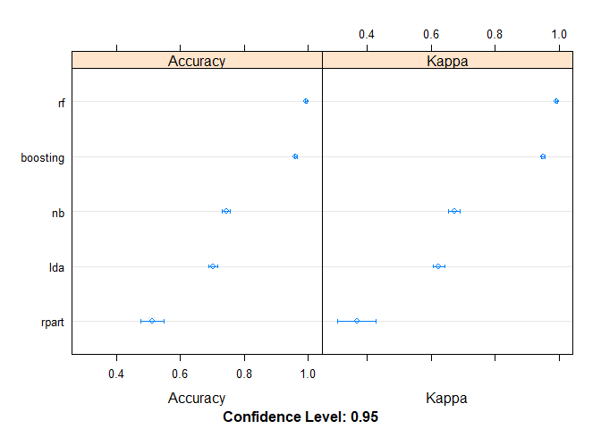

## Synopsis

Today, a large number of devices such as Jawbone Up, Nike FuelBand, and Fitbit it can collect large amount of data about personal activity relatively inexpensively.  
In this project, we will try to use the data collected from accelerometers on the belt, forearm, arm, and dumbell of 6 participants to predict the manner in which they did the exercise.  
We will test different models and pick the best one to predict the class of 20 additional records.

## Data

We used and copied the 2 following data files to the current directory :  
- training data : https://d396qusza40orc.cloudfront.net/predmachlearn/pml-training.csv  
- test data : https://d396qusza40orc.cloudfront.net/predmachlearn/pml-testing.csv  
The original data from this project comes from this source: http://groupware.les.inf.puc-rio.br/har.  


```r
# Load the R libraries
library(caret, warn.conflicts = TRUE)
library(tidyverse, warn.conflicts = TRUE)
```

### Load the Data
From a first file load and summary, we found that a the files contains "NA" and "#DIV/0!". We will convert these values to NAs. 

```r
# Load the CSV files
pmlTraining <- read.csv("pml-training.csv", header=TRUE, na.strings = c("NA","","#DIV/0!"))
pmlTesting <- read.csv("pml-testing.csv", header=TRUE, na.strings = c("NA","","#DIV/0!"))
```

The trainData dataset contains **19622** rows and the testData dataset contains **20** rows. Each dataset contains **160** columns.

### Quick Exploratory analysis
The summary function output has been set in appendix.

```r
# summary(pmlTraining)
# list the levels for the classe factor
levels(pmlTraining$classe)
```

```
## [1] "A" "B" "C" "D" "E"
```

```r
# summarize the classe column distribution
percentage <- prop.table(table(pmlTraining$classe)) * 100
cbind('Count'=table(pmlTraining$classe), '%'=percentage)
```

```
##   Count        %
## A  5580 28.43747
## B  3797 19.35073
## C  3422 17.43961
## D  3216 16.38977
## E  3607 18.38243
```
A lot of columns have a high number of NAs (> 98% of the values).

```r
table(NAs=colSums(is.na(pmlTraining)))
```

```
## NAs
##     0 19216 19217 19218 19220 19221 19225 19226 19227 19248 19293 19294 
##    60    67     1     1     1     4     1     4     2     2     1     1 
## 19296 19299 19300 19301 19622 
##     2     1     4     2     6
```
These NAs do not seem to be specific to an exercise class (ex : an exercise not using a specific devise). We will remove these columns from our predictors.

```r
table(pmlTraining$classe, is.na(pmlTraining$amplitude_roll_forearm))
```

```
##    
##     FALSE TRUE
##   A   109 5471
##   B    79 3718
##   C    70 3352
##   D    69 3147
##   E    79 3528
```

## Clean the data

We will remove the column containings the high number of NAs, and the first 7 columns that are the experiments (user / date / ...) informations.

```r
iNAsColumn <- which(colSums(is.na(pmlTraining))>19000)
pmlTrainingClean <- pmlTraining[,-iNAsColumn]
pmlTrainingClean <- pmlTrainingClean[,-c(1:7)]
```

# Build models

## Split the train dataset in training and validation datasets


```r
# Reproducibility
set.seed(123)
# pick 80% of the rows in the original dataset 
inTrain <- createDataPartition(pmlTrainingClean$classe, p=0.80, list=FALSE)
# 80% of the data to train the models
training <- pmlTrainingClean[inTrain,]
# 20% of the data for validation
validation <- pmlTrainingClean[-inTrain,]

dim(training)
```

```
## [1] 15699    53
```

## Test different models


```r
nbmodels <- length(unique(modelLookup()[modelLookup()$forClass,c(1)]))
```
Caret has **190** classification models. We are going to test 5 models from the course.  

We will use 5-fold cross validation.

```r
trControl <- trainControl(method="cv", number=5)
metric <- "Accuracy"
```

Train different models (using the same seed each time).


```r
# Tree
set.seed(123)
fit.rpart <- train(classe~., data=training, method="rpart", metric=metric, trControl=trControl)

# Random Forest
set.seed(123)
fit.rf <- train(classe~., data=training, method="rf", metric=metric, trControl=trControl)

# Boosting
set.seed(123)
fit.boosting <- train(classe~., data=training, method="gbm", metric=metric, 
                      trControl=trControl, verbose=FALSE)

# Model base prediction: LDA, NB
set.seed(123)
fit.lda <- train(classe~., data=training, method="lda", metric=metric, trControl=trControl)

set.seed(123)
fit.nb <- train(classe~., data=training, method="nb", metric=metric, trControl=trControl)
```

We Compare the models using the resamples caret function.


```r
# Compare algorithms usi,ng the resamples caret function
results <- resamples(list(rpart=fit.rpart,
                          rf=fit.rf, boosting=fit.boosting,
                          lda=fit.lda, nb=fit.nb))

summary(results)
```

```
## 
## Call:
## summary.resamples(object = results)
## 
## Models: rpart, rf, boosting, lda, nb 
## Number of resamples: 5 
## 
## Accuracy 
##               Min.   1st Qu.    Median      Mean   3rd Qu.      Max. NA's
## rpart    0.4877428 0.4914013 0.4998408 0.5116952 0.5226259 0.5568652    0
## rf       0.9910800 0.9910856 0.9923591 0.9928660 0.9945825 0.9952229    0
## boosting 0.9563833 0.9592486 0.9598598 0.9602526 0.9604844 0.9652866    0
## lda      0.6864245 0.7016874 0.7021344 0.7025905 0.7029608 0.7197452    0
## nb       0.7314431 0.7347978 0.7434672 0.7427859 0.7456224 0.7585987    0
## 
## Kappa 
##               Min.   1st Qu.    Median      Mean   3rd Qu.      Max. NA's
## rpart    0.3291271 0.3352490 0.3472442 0.3669742 0.3768489 0.4464020    0
## rf       0.9887176 0.9887204 0.9903344 0.9909754 0.9931474 0.9939574    0
## boosting 0.9448363 0.9484271 0.9492318 0.9497139 0.9499965 0.9560778    0
## lda      0.6038315 0.6224983 0.6227991 0.6236755 0.6242504 0.6449985    0
## nb       0.6564529 0.6603494 0.6712547 0.6718662 0.6800181 0.6912562    0
```

```r
dotplot(results)
```

<!-- -->

  
The random forest model seem to have the better results with an average accuracy above 99.2%.  

## Check the RF model

```r
print(fit.rf)
```

```
## Random Forest 
## 
## 15699 samples
##    52 predictor
##     5 classes: 'A', 'B', 'C', 'D', 'E' 
## 
## No pre-processing
## Resampling: Cross-Validated (5 fold) 
## Summary of sample sizes: 12561, 12559, 12558, 12560, 12558 
## Resampling results across tuning parameters:
## 
##   mtry  Accuracy   Kappa    
##    2    0.9928660  0.9909754
##   27    0.9919740  0.9898475
##   52    0.9870059  0.9835611
## 
## Accuracy was used to select the optimal model using the largest value.
## The final value used for the model was mtry = 2.
```

```r
plot(fit.rf$finalModel,main="RF - Error by number of trees")
```

<!-- -->

The best model seems to use the mtry equal to 2. From the graph, the optimum number of tree seem to be 50 or 100. There is no gain with more trees.  

## Tune the RF model
We will try to tune the RF model using a grid search on the mtry parameters.  

```r
set.seed(123)
trControl <- trainControl(method="repeatedcv", number=5, repeats=3, search="grid")
tuneGrid <- expand.grid(.mtry=c(1:15))
fit.gridsearch <- train(classe~., data=training, method="rf", 
                       metric=metric, tuneGrid=tuneGrid, 
                       trControl=trControl,
                       ntree=100)
print(fit.gridsearch)
```

```
## Random Forest 
## 
## 15699 samples
##    52 predictor
##     5 classes: 'A', 'B', 'C', 'D', 'E' 
## 
## No pre-processing
## Resampling: Cross-Validated (5 fold, repeated 3 times) 
## Summary of sample sizes: 12561, 12559, 12558, 12560, 12558, 12558, ... 
## Resampling results across tuning parameters:
## 
##   mtry  Accuracy   Kappa    
##    1    0.9873029  0.9839363
##    2    0.9916981  0.9894972
##    3    0.9923351  0.9903032
##    4    0.9927596  0.9908407
##    5    0.9932481  0.9914588
##    6    0.9933967  0.9916466
##    7    0.9938214  0.9921840
##    8    0.9937364  0.9920765
##    9    0.9936302  0.9919423
##   10    0.9937364  0.9920767
##   11    0.9936939  0.9920226
##   12    0.9935241  0.9918081
##   13    0.9933116  0.9915390
##   14    0.9938001  0.9921570
##   15    0.9935665  0.9918615
## 
## Accuracy was used to select the optimal model using the largest value.
## The final value used for the model was mtry = 7.
```

```r
plot(fit.gridsearch)
```

<!-- -->

The best value for mtry seems to be 7 for an accuracy of 99.4%.

## Validation
We use the validation dataset to predict and compare the results. We will compute the accuracy and the confusion matrix.  

```r
# predict the result on the validation dataset
predict.rf <- predict(fit.gridsearch,newdata=validation)
conf.rf <- confusionMatrix(validation$classe,predict.rf)
```
  
We have an accuracy of **99.7**% on the validation dataset.  

```r
conf.rf$table
```

```
##           Reference
## Prediction    A    B    C    D    E
##          A 1115    1    0    0    0
##          B    7  749    3    0    0
##          C    0    4  679    1    0
##          D    0    0   11  632    0
##          E    0    0    0    1  720
```


# Compute the class for the quiz

```r
predict.quiz <- predict(fit.gridsearch,newdata=pmlTesting)
predict.quiz
```

```
##  [1] B A B A A E D B A A B C B A E E A B B B
## Levels: A B C D E
```


# Appendix

Summary:

```r
summary(pmlTraining)
```

```
##        X            user_name    raw_timestamp_part_1 raw_timestamp_part_2
##  Min.   :    1   adelmo  :3892   Min.   :1.322e+09    Min.   :   294      
##  1st Qu.: 4906   carlitos:3112   1st Qu.:1.323e+09    1st Qu.:252912      
##  Median : 9812   charles :3536   Median :1.323e+09    Median :496380      
##  Mean   : 9812   eurico  :3070   Mean   :1.323e+09    Mean   :500656      
##  3rd Qu.:14717   jeremy  :3402   3rd Qu.:1.323e+09    3rd Qu.:751891      
##  Max.   :19622   pedro   :2610   Max.   :1.323e+09    Max.   :998801      
##                                                                           
##           cvtd_timestamp  new_window    num_window      roll_belt     
##  28/11/2011 14:14: 1498   no :19216   Min.   :  1.0   Min.   :-28.90  
##  05/12/2011 11:24: 1497   yes:  406   1st Qu.:222.0   1st Qu.:  1.10  
##  30/11/2011 17:11: 1440               Median :424.0   Median :113.00  
##  05/12/2011 11:25: 1425               Mean   :430.6   Mean   : 64.41  
##  02/12/2011 14:57: 1380               3rd Qu.:644.0   3rd Qu.:123.00  
##  02/12/2011 13:34: 1375               Max.   :864.0   Max.   :162.00  
##  (Other)         :11007                                               
##    pitch_belt          yaw_belt       total_accel_belt kurtosis_roll_belt
##  Min.   :-55.8000   Min.   :-180.00   Min.   : 0.00    Min.   :-2.121    
##  1st Qu.:  1.7600   1st Qu.: -88.30   1st Qu.: 3.00    1st Qu.:-1.329    
##  Median :  5.2800   Median : -13.00   Median :17.00    Median :-0.899    
##  Mean   :  0.3053   Mean   : -11.21   Mean   :11.31    Mean   :-0.220    
##  3rd Qu.: 14.9000   3rd Qu.:  12.90   3rd Qu.:18.00    3rd Qu.:-0.219    
##  Max.   : 60.3000   Max.   : 179.00   Max.   :29.00    Max.   :33.000    
##                                                        NA's   :19226     
##  kurtosis_picth_belt kurtosis_yaw_belt skewness_roll_belt
##  Min.   :-2.190      Mode:logical      Min.   :-5.745    
##  1st Qu.:-1.107      NA's:19622        1st Qu.:-0.444    
##  Median :-0.151                        Median : 0.000    
##  Mean   : 4.334                        Mean   :-0.026    
##  3rd Qu.: 3.178                        3rd Qu.: 0.417    
##  Max.   :58.000                        Max.   : 3.595    
##  NA's   :19248                         NA's   :19225     
##  skewness_roll_belt.1 skewness_yaw_belt max_roll_belt     max_picth_belt 
##  Min.   :-7.616       Mode:logical      Min.   :-94.300   Min.   : 3.00  
##  1st Qu.:-1.114       NA's:19622        1st Qu.:-88.000   1st Qu.: 5.00  
##  Median :-0.068                         Median : -5.100   Median :18.00  
##  Mean   :-0.296                         Mean   : -6.667   Mean   :12.92  
##  3rd Qu.: 0.661                         3rd Qu.: 18.500   3rd Qu.:19.00  
##  Max.   : 7.348                         Max.   :180.000   Max.   :30.00  
##  NA's   :19248                          NA's   :19216     NA's   :19216  
##   max_yaw_belt   min_roll_belt     min_pitch_belt   min_yaw_belt  
##  Min.   :-2.10   Min.   :-180.00   Min.   : 0.00   Min.   :-2.10  
##  1st Qu.:-1.30   1st Qu.: -88.40   1st Qu.: 3.00   1st Qu.:-1.30  
##  Median :-0.90   Median :  -7.85   Median :16.00   Median :-0.90  
##  Mean   :-0.22   Mean   : -10.44   Mean   :10.76   Mean   :-0.22  
##  3rd Qu.:-0.20   3rd Qu.:   9.05   3rd Qu.:17.00   3rd Qu.:-0.20  
##  Max.   :33.00   Max.   : 173.00   Max.   :23.00   Max.   :33.00  
##  NA's   :19226   NA's   :19216     NA's   :19216   NA's   :19226  
##  amplitude_roll_belt amplitude_pitch_belt amplitude_yaw_belt
##  Min.   :  0.000     Min.   : 0.000       Min.   :0         
##  1st Qu.:  0.300     1st Qu.: 1.000       1st Qu.:0         
##  Median :  1.000     Median : 1.000       Median :0         
##  Mean   :  3.769     Mean   : 2.167       Mean   :0         
##  3rd Qu.:  2.083     3rd Qu.: 2.000       3rd Qu.:0         
##  Max.   :360.000     Max.   :12.000       Max.   :0         
##  NA's   :19216       NA's   :19216        NA's   :19226     
##  var_total_accel_belt avg_roll_belt    stddev_roll_belt var_roll_belt    
##  Min.   : 0.000       Min.   :-27.40   Min.   : 0.000   Min.   :  0.000  
##  1st Qu.: 0.100       1st Qu.:  1.10   1st Qu.: 0.200   1st Qu.:  0.000  
##  Median : 0.200       Median :116.35   Median : 0.400   Median :  0.100  
##  Mean   : 0.926       Mean   : 68.06   Mean   : 1.337   Mean   :  7.699  
##  3rd Qu.: 0.300       3rd Qu.:123.38   3rd Qu.: 0.700   3rd Qu.:  0.500  
##  Max.   :16.500       Max.   :157.40   Max.   :14.200   Max.   :200.700  
##  NA's   :19216        NA's   :19216    NA's   :19216    NA's   :19216    
##  avg_pitch_belt    stddev_pitch_belt var_pitch_belt    avg_yaw_belt     
##  Min.   :-51.400   Min.   :0.000     Min.   : 0.000   Min.   :-138.300  
##  1st Qu.:  2.025   1st Qu.:0.200     1st Qu.: 0.000   1st Qu.: -88.175  
##  Median :  5.200   Median :0.400     Median : 0.100   Median :  -6.550  
##  Mean   :  0.520   Mean   :0.603     Mean   : 0.766   Mean   :  -8.831  
##  3rd Qu.: 15.775   3rd Qu.:0.700     3rd Qu.: 0.500   3rd Qu.:  14.125  
##  Max.   : 59.700   Max.   :4.000     Max.   :16.200   Max.   : 173.500  
##  NA's   :19216     NA's   :19216     NA's   :19216    NA's   :19216     
##  stddev_yaw_belt    var_yaw_belt        gyros_belt_x      
##  Min.   :  0.000   Min.   :    0.000   Min.   :-1.040000  
##  1st Qu.:  0.100   1st Qu.:    0.010   1st Qu.:-0.030000  
##  Median :  0.300   Median :    0.090   Median : 0.030000  
##  Mean   :  1.341   Mean   :  107.487   Mean   :-0.005592  
##  3rd Qu.:  0.700   3rd Qu.:    0.475   3rd Qu.: 0.110000  
##  Max.   :176.600   Max.   :31183.240   Max.   : 2.220000  
##  NA's   :19216     NA's   :19216                          
##   gyros_belt_y       gyros_belt_z      accel_belt_x       accel_belt_y   
##  Min.   :-0.64000   Min.   :-1.4600   Min.   :-120.000   Min.   :-69.00  
##  1st Qu.: 0.00000   1st Qu.:-0.2000   1st Qu.: -21.000   1st Qu.:  3.00  
##  Median : 0.02000   Median :-0.1000   Median : -15.000   Median : 35.00  
##  Mean   : 0.03959   Mean   :-0.1305   Mean   :  -5.595   Mean   : 30.15  
##  3rd Qu.: 0.11000   3rd Qu.:-0.0200   3rd Qu.:  -5.000   3rd Qu.: 61.00  
##  Max.   : 0.64000   Max.   : 1.6200   Max.   :  85.000   Max.   :164.00  
##                                                                          
##   accel_belt_z     magnet_belt_x   magnet_belt_y   magnet_belt_z   
##  Min.   :-275.00   Min.   :-52.0   Min.   :354.0   Min.   :-623.0  
##  1st Qu.:-162.00   1st Qu.:  9.0   1st Qu.:581.0   1st Qu.:-375.0  
##  Median :-152.00   Median : 35.0   Median :601.0   Median :-320.0  
##  Mean   : -72.59   Mean   : 55.6   Mean   :593.7   Mean   :-345.5  
##  3rd Qu.:  27.00   3rd Qu.: 59.0   3rd Qu.:610.0   3rd Qu.:-306.0  
##  Max.   : 105.00   Max.   :485.0   Max.   :673.0   Max.   : 293.0  
##                                                                    
##     roll_arm         pitch_arm          yaw_arm          total_accel_arm
##  Min.   :-180.00   Min.   :-88.800   Min.   :-180.0000   Min.   : 1.00  
##  1st Qu.: -31.77   1st Qu.:-25.900   1st Qu.: -43.1000   1st Qu.:17.00  
##  Median :   0.00   Median :  0.000   Median :   0.0000   Median :27.00  
##  Mean   :  17.83   Mean   : -4.612   Mean   :  -0.6188   Mean   :25.51  
##  3rd Qu.:  77.30   3rd Qu.: 11.200   3rd Qu.:  45.8750   3rd Qu.:33.00  
##  Max.   : 180.00   Max.   : 88.500   Max.   : 180.0000   Max.   :66.00  
##                                                                         
##  var_accel_arm     avg_roll_arm     stddev_roll_arm    var_roll_arm      
##  Min.   :  0.00   Min.   :-166.67   Min.   :  0.000   Min.   :    0.000  
##  1st Qu.:  9.03   1st Qu.: -38.37   1st Qu.:  1.376   1st Qu.:    1.898  
##  Median : 40.61   Median :   0.00   Median :  5.702   Median :   32.517  
##  Mean   : 53.23   Mean   :  12.68   Mean   : 11.201   Mean   :  417.264  
##  3rd Qu.: 75.62   3rd Qu.:  76.33   3rd Qu.: 14.921   3rd Qu.:  222.647  
##  Max.   :331.70   Max.   : 163.33   Max.   :161.964   Max.   :26232.208  
##  NA's   :19216    NA's   :19216     NA's   :19216     NA's   :19216      
##  avg_pitch_arm     stddev_pitch_arm var_pitch_arm       avg_yaw_arm      
##  Min.   :-81.773   Min.   : 0.000   Min.   :   0.000   Min.   :-173.440  
##  1st Qu.:-22.770   1st Qu.: 1.642   1st Qu.:   2.697   1st Qu.: -29.198  
##  Median :  0.000   Median : 8.133   Median :  66.146   Median :   0.000  
##  Mean   : -4.901   Mean   :10.383   Mean   : 195.864   Mean   :   2.359  
##  3rd Qu.:  8.277   3rd Qu.:16.327   3rd Qu.: 266.576   3rd Qu.:  38.185  
##  Max.   : 75.659   Max.   :43.412   Max.   :1884.565   Max.   : 152.000  
##  NA's   :19216     NA's   :19216    NA's   :19216      NA's   :19216     
##  stddev_yaw_arm     var_yaw_arm         gyros_arm_x      
##  Min.   :  0.000   Min.   :    0.000   Min.   :-6.37000  
##  1st Qu.:  2.577   1st Qu.:    6.642   1st Qu.:-1.33000  
##  Median : 16.682   Median :  278.309   Median : 0.08000  
##  Mean   : 22.270   Mean   : 1055.933   Mean   : 0.04277  
##  3rd Qu.: 35.984   3rd Qu.: 1294.850   3rd Qu.: 1.57000  
##  Max.   :177.044   Max.   :31344.568   Max.   : 4.87000  
##  NA's   :19216     NA's   :19216                         
##   gyros_arm_y       gyros_arm_z       accel_arm_x       accel_arm_y    
##  Min.   :-3.4400   Min.   :-2.3300   Min.   :-404.00   Min.   :-318.0  
##  1st Qu.:-0.8000   1st Qu.:-0.0700   1st Qu.:-242.00   1st Qu.: -54.0  
##  Median :-0.2400   Median : 0.2300   Median : -44.00   Median :  14.0  
##  Mean   :-0.2571   Mean   : 0.2695   Mean   : -60.24   Mean   :  32.6  
##  3rd Qu.: 0.1400   3rd Qu.: 0.7200   3rd Qu.:  84.00   3rd Qu.: 139.0  
##  Max.   : 2.8400   Max.   : 3.0200   Max.   : 437.00   Max.   : 308.0  
##                                                                        
##   accel_arm_z       magnet_arm_x     magnet_arm_y     magnet_arm_z   
##  Min.   :-636.00   Min.   :-584.0   Min.   :-392.0   Min.   :-597.0  
##  1st Qu.:-143.00   1st Qu.:-300.0   1st Qu.:  -9.0   1st Qu.: 131.2  
##  Median : -47.00   Median : 289.0   Median : 202.0   Median : 444.0  
##  Mean   : -71.25   Mean   : 191.7   Mean   : 156.6   Mean   : 306.5  
##  3rd Qu.:  23.00   3rd Qu.: 637.0   3rd Qu.: 323.0   3rd Qu.: 545.0  
##  Max.   : 292.00   Max.   : 782.0   Max.   : 583.0   Max.   : 694.0  
##                                                                      
##  kurtosis_roll_arm kurtosis_picth_arm kurtosis_yaw_arm skewness_roll_arm
##  Min.   :-1.809    Min.   :-2.084     Min.   :-2.103   Min.   :-2.541   
##  1st Qu.:-1.345    1st Qu.:-1.280     1st Qu.:-1.220   1st Qu.:-0.561   
##  Median :-0.894    Median :-1.010     Median :-0.733   Median : 0.040   
##  Mean   :-0.366    Mean   :-0.542     Mean   : 0.406   Mean   : 0.068   
##  3rd Qu.:-0.038    3rd Qu.:-0.379     3rd Qu.: 0.115   3rd Qu.: 0.671   
##  Max.   :21.456    Max.   :19.751     Max.   :56.000   Max.   : 4.394   
##  NA's   :19294     NA's   :19296      NA's   :19227    NA's   :19293    
##  skewness_pitch_arm skewness_yaw_arm  max_roll_arm     max_picth_arm     
##  Min.   :-4.565     Min.   :-6.708   Min.   :-73.100   Min.   :-173.000  
##  1st Qu.:-0.618     1st Qu.:-0.743   1st Qu.: -0.175   1st Qu.:  -1.975  
##  Median :-0.035     Median :-0.133   Median :  4.950   Median :  23.250  
##  Mean   :-0.065     Mean   :-0.229   Mean   : 11.236   Mean   :  35.751  
##  3rd Qu.: 0.454     3rd Qu.: 0.344   3rd Qu.: 26.775   3rd Qu.:  95.975  
##  Max.   : 3.043     Max.   : 7.483   Max.   : 85.500   Max.   : 180.000  
##  NA's   :19296      NA's   :19227    NA's   :19216     NA's   :19216     
##   max_yaw_arm     min_roll_arm    min_pitch_arm      min_yaw_arm   
##  Min.   : 4.00   Min.   :-89.10   Min.   :-180.00   Min.   : 1.00  
##  1st Qu.:29.00   1st Qu.:-41.98   1st Qu.: -72.62   1st Qu.: 8.00  
##  Median :34.00   Median :-22.45   Median : -33.85   Median :13.00  
##  Mean   :35.46   Mean   :-21.22   Mean   : -33.92   Mean   :14.66  
##  3rd Qu.:41.00   3rd Qu.:  0.00   3rd Qu.:   0.00   3rd Qu.:19.00  
##  Max.   :65.00   Max.   : 66.40   Max.   : 152.00   Max.   :38.00  
##  NA's   :19216   NA's   :19216    NA's   :19216     NA's   :19216  
##  amplitude_roll_arm amplitude_pitch_arm amplitude_yaw_arm
##  Min.   :  0.000    Min.   :  0.000     Min.   : 0.00    
##  1st Qu.:  5.425    1st Qu.:  9.925     1st Qu.:13.00    
##  Median : 28.450    Median : 54.900     Median :22.00    
##  Mean   : 32.452    Mean   : 69.677     Mean   :20.79    
##  3rd Qu.: 50.960    3rd Qu.:115.175     3rd Qu.:28.75    
##  Max.   :119.500    Max.   :360.000     Max.   :52.00    
##  NA's   :19216      NA's   :19216       NA's   :19216    
##  roll_dumbbell     pitch_dumbbell     yaw_dumbbell     
##  Min.   :-153.71   Min.   :-149.59   Min.   :-150.871  
##  1st Qu.: -18.49   1st Qu.: -40.89   1st Qu.: -77.644  
##  Median :  48.17   Median : -20.96   Median :  -3.324  
##  Mean   :  23.84   Mean   : -10.78   Mean   :   1.674  
##  3rd Qu.:  67.61   3rd Qu.:  17.50   3rd Qu.:  79.643  
##  Max.   : 153.55   Max.   : 149.40   Max.   : 154.952  
##                                                        
##  kurtosis_roll_dumbbell kurtosis_picth_dumbbell kurtosis_yaw_dumbbell
##  Min.   :-2.174         Min.   :-2.200          Mode:logical         
##  1st Qu.:-0.682         1st Qu.:-0.721          NA's:19622           
##  Median :-0.033         Median :-0.133                               
##  Mean   : 0.452         Mean   : 0.286                               
##  3rd Qu.: 0.940         3rd Qu.: 0.584                               
##  Max.   :54.998         Max.   :55.628                               
##  NA's   :19221          NA's   :19218                                
##  skewness_roll_dumbbell skewness_pitch_dumbbell skewness_yaw_dumbbell
##  Min.   :-7.384         Min.   :-7.447          Mode:logical         
##  1st Qu.:-0.581         1st Qu.:-0.526          NA's:19622           
##  Median :-0.076         Median :-0.091                               
##  Mean   :-0.115         Mean   :-0.035                               
##  3rd Qu.: 0.400         3rd Qu.: 0.505                               
##  Max.   : 1.958         Max.   : 3.769                               
##  NA's   :19220          NA's   :19217                                
##  max_roll_dumbbell max_picth_dumbbell max_yaw_dumbbell min_roll_dumbbell
##  Min.   :-70.10    Min.   :-112.90    Min.   :-2.20    Min.   :-149.60  
##  1st Qu.:-27.15    1st Qu.: -66.70    1st Qu.:-0.70    1st Qu.: -59.67  
##  Median : 14.85    Median :  40.05    Median : 0.00    Median : -43.55  
##  Mean   : 13.76    Mean   :  32.75    Mean   : 0.45    Mean   : -41.24  
##  3rd Qu.: 50.58    3rd Qu.: 133.22    3rd Qu.: 0.90    3rd Qu.: -25.20  
##  Max.   :137.00    Max.   : 155.00    Max.   :55.00    Max.   :  73.20  
##  NA's   :19216     NA's   :19216      NA's   :19221    NA's   :19216    
##  min_pitch_dumbbell min_yaw_dumbbell amplitude_roll_dumbbell
##  Min.   :-147.00    Min.   :-2.20    Min.   :  0.00         
##  1st Qu.: -91.80    1st Qu.:-0.70    1st Qu.: 14.97         
##  Median : -66.15    Median : 0.00    Median : 35.05         
##  Mean   : -33.18    Mean   : 0.45    Mean   : 55.00         
##  3rd Qu.:  21.20    3rd Qu.: 0.90    3rd Qu.: 81.04         
##  Max.   : 120.90    Max.   :55.00    Max.   :256.48         
##  NA's   :19216      NA's   :19221    NA's   :19216          
##  amplitude_pitch_dumbbell amplitude_yaw_dumbbell total_accel_dumbbell
##  Min.   :  0.00           Min.   :0              Min.   : 0.00       
##  1st Qu.: 17.06           1st Qu.:0              1st Qu.: 4.00       
##  Median : 41.73           Median :0              Median :10.00       
##  Mean   : 65.93           Mean   :0              Mean   :13.72       
##  3rd Qu.: 99.55           3rd Qu.:0              3rd Qu.:19.00       
##  Max.   :273.59           Max.   :0              Max.   :58.00       
##  NA's   :19216            NA's   :19221                              
##  var_accel_dumbbell avg_roll_dumbbell stddev_roll_dumbbell
##  Min.   :  0.000    Min.   :-128.96   Min.   :  0.000     
##  1st Qu.:  0.378    1st Qu.: -12.33   1st Qu.:  4.639     
##  Median :  1.000    Median :  48.23   Median : 12.204     
##  Mean   :  4.388    Mean   :  23.86   Mean   : 20.761     
##  3rd Qu.:  3.434    3rd Qu.:  64.37   3rd Qu.: 26.356     
##  Max.   :230.428    Max.   : 125.99   Max.   :123.778     
##  NA's   :19216      NA's   :19216     NA's   :19216       
##  var_roll_dumbbell  avg_pitch_dumbbell stddev_pitch_dumbbell
##  Min.   :    0.00   Min.   :-70.73     Min.   : 0.000       
##  1st Qu.:   21.52   1st Qu.:-42.00     1st Qu.: 3.482       
##  Median :  148.95   Median :-19.91     Median : 8.089       
##  Mean   : 1020.27   Mean   :-12.33     Mean   :13.147       
##  3rd Qu.:  694.65   3rd Qu.: 13.21     3rd Qu.:19.238       
##  Max.   :15321.01   Max.   : 94.28     Max.   :82.680       
##  NA's   :19216      NA's   :19216      NA's   :19216        
##  var_pitch_dumbbell avg_yaw_dumbbell   stddev_yaw_dumbbell
##  Min.   :   0.00    Min.   :-117.950   Min.   :  0.000    
##  1st Qu.:  12.12    1st Qu.: -76.696   1st Qu.:  3.885    
##  Median :  65.44    Median :  -4.505   Median : 10.264    
##  Mean   : 350.31    Mean   :   0.202   Mean   : 16.647    
##  3rd Qu.: 370.11    3rd Qu.:  71.234   3rd Qu.: 24.674    
##  Max.   :6836.02    Max.   : 134.905   Max.   :107.088    
##  NA's   :19216      NA's   :19216      NA's   :19216      
##  var_yaw_dumbbell   gyros_dumbbell_x    gyros_dumbbell_y  
##  Min.   :    0.00   Min.   :-204.0000   Min.   :-2.10000  
##  1st Qu.:   15.09   1st Qu.:  -0.0300   1st Qu.:-0.14000  
##  Median :  105.35   Median :   0.1300   Median : 0.03000  
##  Mean   :  589.84   Mean   :   0.1611   Mean   : 0.04606  
##  3rd Qu.:  608.79   3rd Qu.:   0.3500   3rd Qu.: 0.21000  
##  Max.   :11467.91   Max.   :   2.2200   Max.   :52.00000  
##  NA's   :19216                                            
##  gyros_dumbbell_z  accel_dumbbell_x  accel_dumbbell_y  accel_dumbbell_z 
##  Min.   : -2.380   Min.   :-419.00   Min.   :-189.00   Min.   :-334.00  
##  1st Qu.: -0.310   1st Qu.: -50.00   1st Qu.:  -8.00   1st Qu.:-142.00  
##  Median : -0.130   Median :  -8.00   Median :  41.50   Median :  -1.00  
##  Mean   : -0.129   Mean   : -28.62   Mean   :  52.63   Mean   : -38.32  
##  3rd Qu.:  0.030   3rd Qu.:  11.00   3rd Qu.: 111.00   3rd Qu.:  38.00  
##  Max.   :317.000   Max.   : 235.00   Max.   : 315.00   Max.   : 318.00  
##                                                                         
##  magnet_dumbbell_x magnet_dumbbell_y magnet_dumbbell_z  roll_forearm      
##  Min.   :-643.0    Min.   :-3600     Min.   :-262.00   Min.   :-180.0000  
##  1st Qu.:-535.0    1st Qu.:  231     1st Qu.: -45.00   1st Qu.:  -0.7375  
##  Median :-479.0    Median :  311     Median :  13.00   Median :  21.7000  
##  Mean   :-328.5    Mean   :  221     Mean   :  46.05   Mean   :  33.8265  
##  3rd Qu.:-304.0    3rd Qu.:  390     3rd Qu.:  95.00   3rd Qu.: 140.0000  
##  Max.   : 592.0    Max.   :  633     Max.   : 452.00   Max.   : 180.0000  
##                                                                           
##  pitch_forearm     yaw_forearm      kurtosis_roll_forearm
##  Min.   :-72.50   Min.   :-180.00   Min.   :-1.879       
##  1st Qu.:  0.00   1st Qu.: -68.60   1st Qu.:-1.398       
##  Median :  9.24   Median :   0.00   Median :-1.119       
##  Mean   : 10.71   Mean   :  19.21   Mean   :-0.689       
##  3rd Qu.: 28.40   3rd Qu.: 110.00   3rd Qu.:-0.618       
##  Max.   : 89.80   Max.   : 180.00   Max.   :40.060       
##                                     NA's   :19300        
##  kurtosis_picth_forearm kurtosis_yaw_forearm skewness_roll_forearm
##  Min.   :-2.098         Mode:logical         Min.   :-2.297       
##  1st Qu.:-1.376         NA's:19622           1st Qu.:-0.402       
##  Median :-0.890                              Median : 0.003       
##  Mean   : 0.419                              Mean   :-0.009       
##  3rd Qu.: 0.054                              3rd Qu.: 0.370       
##  Max.   :33.626                              Max.   : 5.856       
##  NA's   :19301                               NA's   :19299        
##  skewness_pitch_forearm skewness_yaw_forearm max_roll_forearm
##  Min.   :-5.241         Mode:logical         Min.   :-66.60  
##  1st Qu.:-0.881         NA's:19622           1st Qu.:  0.00  
##  Median :-0.156                              Median : 26.80  
##  Mean   :-0.223                              Mean   : 24.49  
##  3rd Qu.: 0.514                              3rd Qu.: 45.95  
##  Max.   : 4.464                              Max.   : 89.80  
##  NA's   :19301                               NA's   :19216   
##  max_picth_forearm max_yaw_forearm  min_roll_forearm  min_pitch_forearm
##  Min.   :-151.00   Min.   :-1.900   Min.   :-72.500   Min.   :-180.00  
##  1st Qu.:   0.00   1st Qu.:-1.400   1st Qu.: -6.075   1st Qu.:-175.00  
##  Median : 113.00   Median :-1.100   Median :  0.000   Median : -61.00  
##  Mean   :  81.49   Mean   :-0.689   Mean   : -0.167   Mean   : -57.57  
##  3rd Qu.: 174.75   3rd Qu.:-0.600   3rd Qu.: 12.075   3rd Qu.:   0.00  
##  Max.   : 180.00   Max.   :40.100   Max.   : 62.100   Max.   : 167.00  
##  NA's   :19216     NA's   :19300    NA's   :19216     NA's   :19216    
##  min_yaw_forearm  amplitude_roll_forearm amplitude_pitch_forearm
##  Min.   :-1.900   Min.   :  0.000        Min.   :  0.0          
##  1st Qu.:-1.400   1st Qu.:  1.125        1st Qu.:  2.0          
##  Median :-1.100   Median : 17.770        Median : 83.7          
##  Mean   :-0.689   Mean   : 24.653        Mean   :139.1          
##  3rd Qu.:-0.600   3rd Qu.: 39.875        3rd Qu.:350.0          
##  Max.   :40.100   Max.   :126.000        Max.   :360.0          
##  NA's   :19300    NA's   :19216          NA's   :19216          
##  amplitude_yaw_forearm total_accel_forearm var_accel_forearm
##  Min.   :0             Min.   :  0.00      Min.   :  0.000  
##  1st Qu.:0             1st Qu.: 29.00      1st Qu.:  6.759  
##  Median :0             Median : 36.00      Median : 21.165  
##  Mean   :0             Mean   : 34.72      Mean   : 33.502  
##  3rd Qu.:0             3rd Qu.: 41.00      3rd Qu.: 51.240  
##  Max.   :0             Max.   :108.00      Max.   :172.606  
##  NA's   :19300                             NA's   :19216    
##  avg_roll_forearm   stddev_roll_forearm var_roll_forearm  
##  Min.   :-177.234   Min.   :  0.000     Min.   :    0.00  
##  1st Qu.:  -0.909   1st Qu.:  0.428     1st Qu.:    0.18  
##  Median :  11.172   Median :  8.030     Median :   64.48  
##  Mean   :  33.165   Mean   : 41.986     Mean   : 5274.10  
##  3rd Qu.: 107.132   3rd Qu.: 85.373     3rd Qu.: 7289.08  
##  Max.   : 177.256   Max.   :179.171     Max.   :32102.24  
##  NA's   :19216      NA's   :19216       NA's   :19216     
##  avg_pitch_forearm stddev_pitch_forearm var_pitch_forearm 
##  Min.   :-68.17    Min.   : 0.000       Min.   :   0.000  
##  1st Qu.:  0.00    1st Qu.: 0.336       1st Qu.:   0.113  
##  Median : 12.02    Median : 5.516       Median :  30.425  
##  Mean   : 11.79    Mean   : 7.977       Mean   : 139.593  
##  3rd Qu.: 28.48    3rd Qu.:12.866       3rd Qu.: 165.532  
##  Max.   : 72.09    Max.   :47.745       Max.   :2279.617  
##  NA's   :19216     NA's   :19216        NA's   :19216     
##  avg_yaw_forearm   stddev_yaw_forearm var_yaw_forearm    gyros_forearm_x  
##  Min.   :-155.06   Min.   :  0.000    Min.   :    0.00   Min.   :-22.000  
##  1st Qu.: -26.26   1st Qu.:  0.524    1st Qu.:    0.27   1st Qu.: -0.220  
##  Median :   0.00   Median : 24.743    Median :  612.21   Median :  0.050  
##  Mean   :  18.00   Mean   : 44.854    Mean   : 4639.85   Mean   :  0.158  
##  3rd Qu.:  85.79   3rd Qu.: 85.817    3rd Qu.: 7368.41   3rd Qu.:  0.560  
##  Max.   : 169.24   Max.   :197.508    Max.   :39009.33   Max.   :  3.970  
##  NA's   :19216     NA's   :19216      NA's   :19216                       
##  gyros_forearm_y     gyros_forearm_z    accel_forearm_x   accel_forearm_y 
##  Min.   : -7.02000   Min.   : -8.0900   Min.   :-498.00   Min.   :-632.0  
##  1st Qu.: -1.46000   1st Qu.: -0.1800   1st Qu.:-178.00   1st Qu.:  57.0  
##  Median :  0.03000   Median :  0.0800   Median : -57.00   Median : 201.0  
##  Mean   :  0.07517   Mean   :  0.1512   Mean   : -61.65   Mean   : 163.7  
##  3rd Qu.:  1.62000   3rd Qu.:  0.4900   3rd Qu.:  76.00   3rd Qu.: 312.0  
##  Max.   :311.00000   Max.   :231.0000   Max.   : 477.00   Max.   : 923.0  
##                                                                           
##  accel_forearm_z   magnet_forearm_x  magnet_forearm_y magnet_forearm_z
##  Min.   :-446.00   Min.   :-1280.0   Min.   :-896.0   Min.   :-973.0  
##  1st Qu.:-182.00   1st Qu.: -616.0   1st Qu.:   2.0   1st Qu.: 191.0  
##  Median : -39.00   Median : -378.0   Median : 591.0   Median : 511.0  
##  Mean   : -55.29   Mean   : -312.6   Mean   : 380.1   Mean   : 393.6  
##  3rd Qu.:  26.00   3rd Qu.:  -73.0   3rd Qu.: 737.0   3rd Qu.: 653.0  
##  Max.   : 291.00   Max.   :  672.0   Max.   :1480.0   Max.   :1090.0  
##                                                                       
##  classe  
##  A:5580  
##  B:3797  
##  C:3422  
##  D:3216  
##  E:3607  
##          
## 
```
