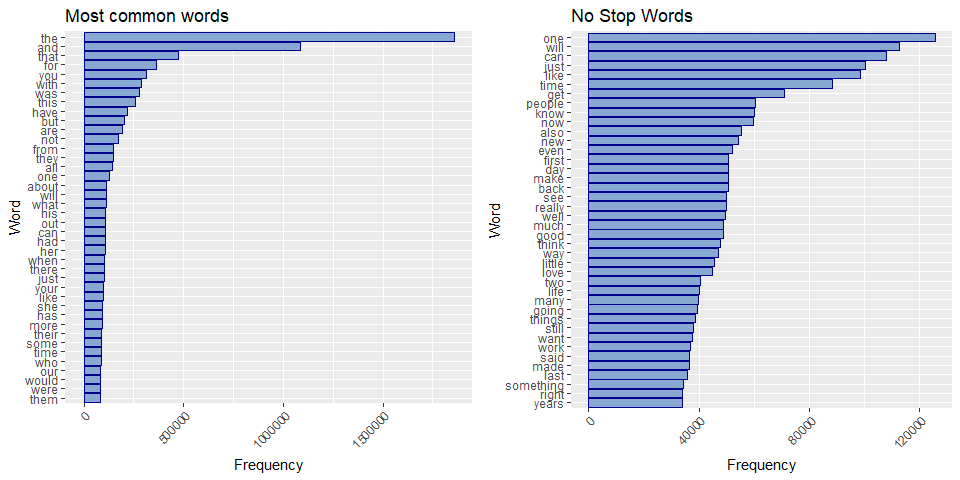
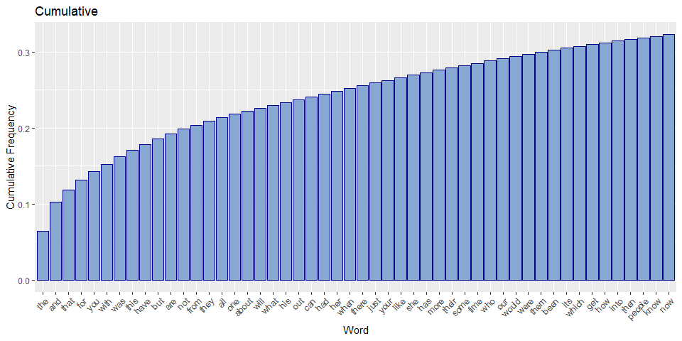
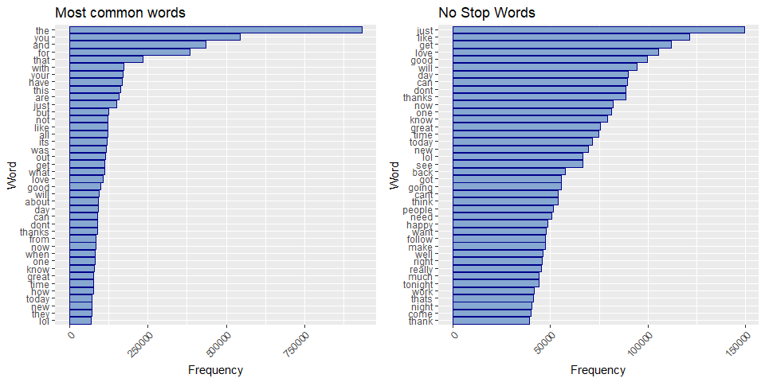
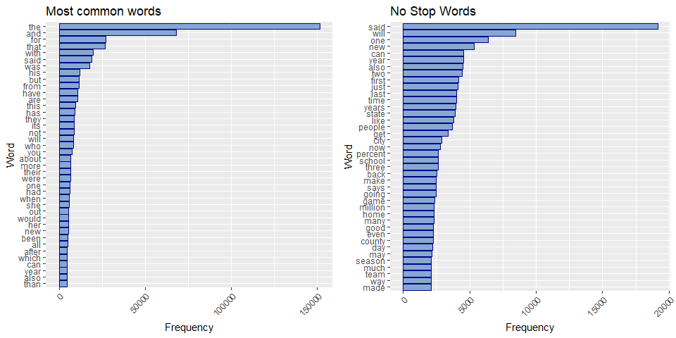
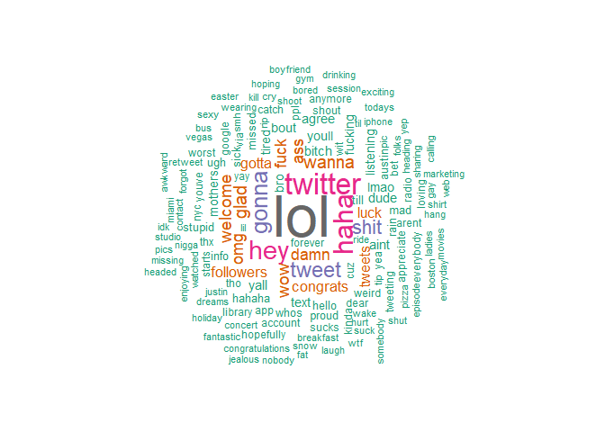
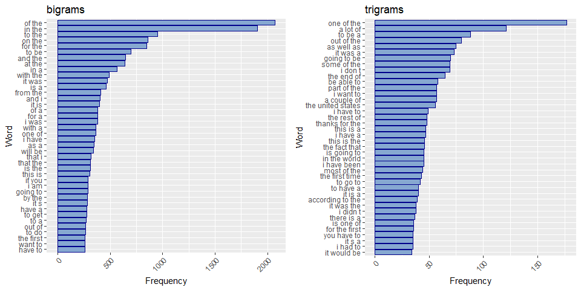
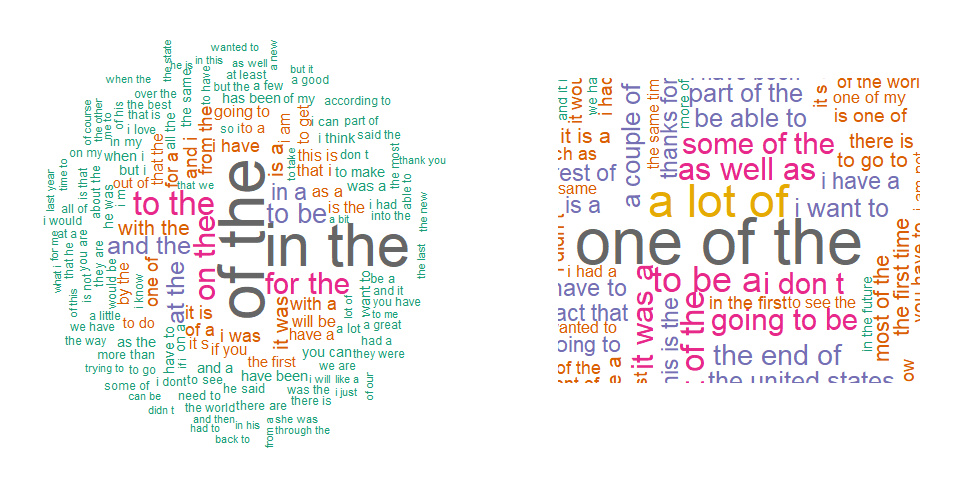

## Introduction

The goal of Coursera Capstone project is to build a predictive text completion model. This milestone report contains a basic exploratory analysis on the SwifKey datasets and feedbacks on my plans for creating a predictive algorithm and Shiny app.  
In this short document, we will :  
1. Download the original datasets and load them in memory,  
2. Generate basic summary statistics about these files,  
3. Use the `tm` package to clean the data and explore the relationship between words,    
4. Try to plan the next steps to complete the project.  

The source code can be found in the following GitHub repository: [chris-FR-GitHub/Coursera-Johns-Hopkins](https://github.com/chris-FR-GitHub/Coursera-Johns-Hopkins/tree/master/10-Capstone-Project)

## Loading the data files

All the original data will be stored under the **data** folder.  
The script load the **Coursera-SwiftKey.zip** file if it is not already in the data folder. It will extract only the en-US files in the same folder if they have not been already extracted.  
We will work the the 3 following files:  
- en_US.blogs.txt,  
- en_US.news.txt,  
- en_US.twitter.txt.  


## Basic summary

Even if the 3 files have around the same size on disk, they do not contains the same number of lines. the Twitter file has the more recards as tweets have limited length.  


File       Size on disk (Mb)   Size in memory disk (Mb)   Char Count   Word Count   Line Count   Avg Line Length   Max Line Length
--------  ------------------  -------------------------  -----------  -----------  -----------  ----------------  ----------------
blogs                  200.4                      255.4    206824505     38309620       899288             230.0             40833
news                   196.3                       19.8     15639408      2741594        77259             202.4              5760
twitter                159.4                      319.0    162096241     31003544      2360148              68.7               140


## Build the document corpus (using TM) and word frequency data tables

We will use the `tm` package (text mining) to build our document corpus.  
For this first analysis (1 word), we will keep the 3 documents separated and we will also use the full documents (no sample).  

We will clean the text by removing :  
- invalid characters,  
- numbers,  
- punctuation,  
- extra white spaces.  
We will also convert all words to lower case.  

We do not remove the "stop words". I do not know yet how to handle the stop words to build the predictive model. As we want to predict the next word, we may want to predict stop words.  
For this analysis, I will just remove them (parameter option) when building the word frequency data tables.  
We also did not remove the curses words.


### Blogs



We can see that "Stop words"" are the most frequently used word. They represent **62%** of the first 100 words.  



On 373431 words (including stop words):  
- 24 words represents 25% of the words,  
- 100 words represents 40% of the words,  
- 242 words represents 50% of the words,  
- 575 words represents 60% of the words,  
- 3067 words represents 80% of the words,  
- 21221 words represents 95% of the words,  
- 122477 words represents 99% of the words.

Even if a few words represent 50% of the text, we have nearly 90000 words for the last 20% (the frequency drops quicly).

### Twitter



Stop words represent **45%** of the first 100 words.

On 476780 words (including stop words):  
- 32 words represents 25% of the words,  
- 108 words represents 40% of the words,  
- 220 words represents 50% of the words,  
- 453 words represents 60% of the words,  
- 2434 words represents 80% of the words,  
- 22326 words represents 95% of the words,  
- 250252 words represents 99% of the words.

We need less distinct words to arrive at 50% of all the words. But there are more different words so a lot of words are not really used... There seems to have a lots of typos (missing space, invalid word, ...)

We may need to change our cleanup rules to remove all the **#name** (ex: #IlovethisMovie).


### News



Stop words represent **57%** of the first 100 words.

On 87187 words (including stop words):  
- 31 words represents 25% of the words,  
- 168 words represents 40% of the words,  
- 413 words represents 50% of the words,  
- 897 words represents 60% of the words,  
- 3921 words represents 80% of the words,  
- 22283 words represents 95% of the words,  
- 66131 words represents 99% of the words.

### Similarity between top words

We can try to compute the percentage of similar words in the TOP XX words of each document. As we did not stem the word nor remove the plural, ... this table check only exact matches.  


| --- | Blogs | Twitter | News | 
| --- | --- | --- | --- | 
| **TOP 100 words** | 
| + **Blogs** | - |  61% | 63% | 
| + **Twitter** | 61% | - | 51% | 
| + **News** | 63% | 51% | - | 
| **TOP 250 words** | 
| + **Blogs** | - |  63.2% | 59.2% | 
| + **Twitter** | 63.2% | - | 49.6% | 
| + **News** | 59.2% | 49.6% | - | 
| **TOP 500 words** | 
| + **Blogs** | - |  69.6% | 63.6% | 
| + **Twitter** | 69.6% | - | 53% | 
| + **News** | 63.6% | 53% | - | 

The similarity between the 3 types of text is around to 50-60%.  
If we don't exclude the stop words, except between News and Twitter (where the average is only around 60%), the similarity is above 70%. We may use a single model.  


### Twitter only words
Twitter texts have some short words, acronyms, abbreviations, ... that are not in the other texts.



## N-Grams

As we need to predict the next word, we need to check groups of words (n-grams). To limit the processing time and memory (use of VCorpus), we will sample the data instead of using the full files.  
We will store these sample in the **datasample** folder.   
For this report, we just pick 5000 lines samples. We may ajust this value (or work with percentage) depending of the results.  


We build a "Volatile" corpus (it is stored in memory and would be destroyed when the R object containing it is destroyed) from these files and use the same cleaning function.


```r
vcorpus_sample <- VCorpus(
    DirSource(folder_datasample),
    readerControl = list(reader = readPlain, language  = "en")
    
)
# clean the corpus
vcorpus_sample <- cleanCorpus(vcorpus_sample)
# inspect(vcorpus_sample)
```

From this VCorpus, we can build bi-grams and tri-grams.

```r
n<- 2
tdm.bigram <- tdm2(vcorpus_sample, ngmin = n, ngmax = n)
n<- 3
tdm.trigram <- tdm2(vcorpus_sample, ngmin = n, ngmax = n)
```

```r
inspect(tdm.trigram)
```

```
## <<TermDocumentMatrix (terms: 382595, documents: 3)>>
## Non-/sparse entries: 395666/752119
## Sparsity           : 66%
## Maximal term length: 264
## Weighting          : term frequency (tf)
## Sample             :
##              Docs
## Terms         en_US.blogs.sample.txt en_US.news.sample.txt
##   a lot of                        64                    48
##   as well as                      49                    26
##   going to be                     25                    31
##   i don t                         61                     8
##   it was a                        38                    26
##   one of the                      85                    77
##   out of the                      47                    28
##   some of the                     41                    24
##   the end of                      30                    27
##   to be a                         46                    29
##              Docs
## Terms         en_US.twitter.sample.txt
##   a lot of                           9
##   as well as                         0
##   going to be                       14
##   i don t                            0
##   it was a                           9
##   one of the                        15
##   out of the                         5
##   some of the                        4
##   the end of                         8
##   to be a                           13
```







# Plans / future steps

I plan to use the frequency matrices to get the next word prediction. I may start to search the tri-grams, then the bi-grams, then most populat word. If I keep the stop words, I may try to compute 2 models (1 with to propose stops words) , one without to propose a word depending of the real word before or I may use 4-grams.

I still need to determine:  
- the optimal size of the uni, bi and tri grams frequency matrices,  
- what is the sample size needed to cover a large majority of word sequence but keeping the size of the objects and the prediction speed low,  
- if i should stem the words to build the frequency matrices, predict a stem and complete it.  

For the GUI, i plan to create a simple textbox with under a list of dynamic buttons with the proposed words.


